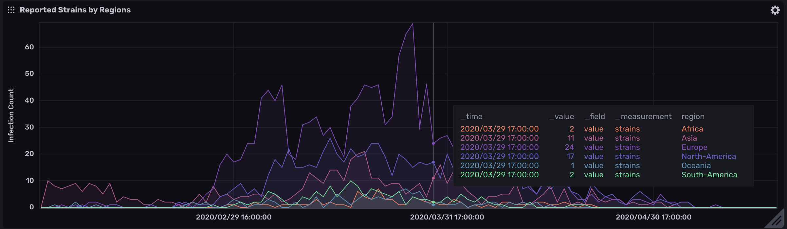
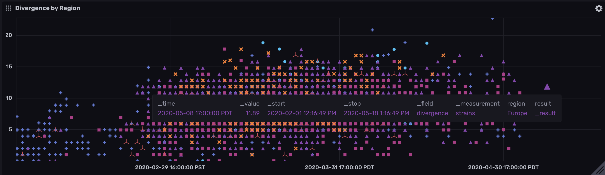
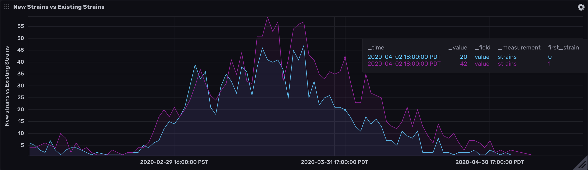
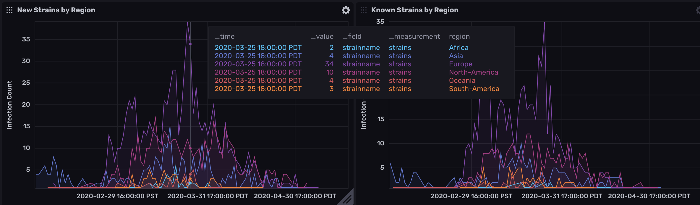
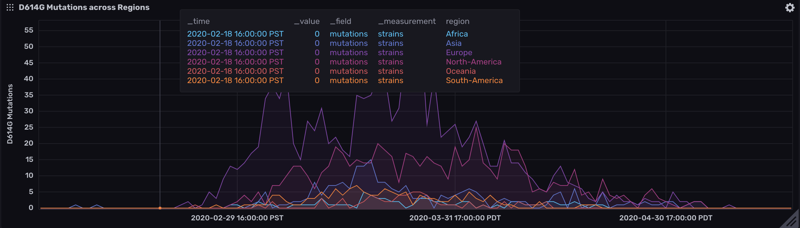
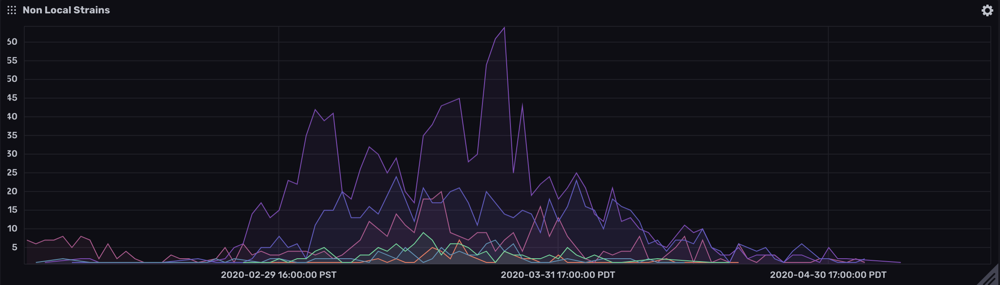
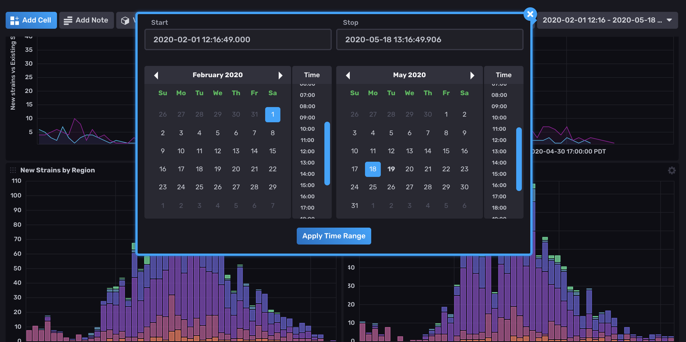
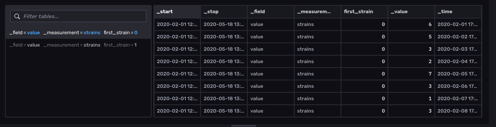
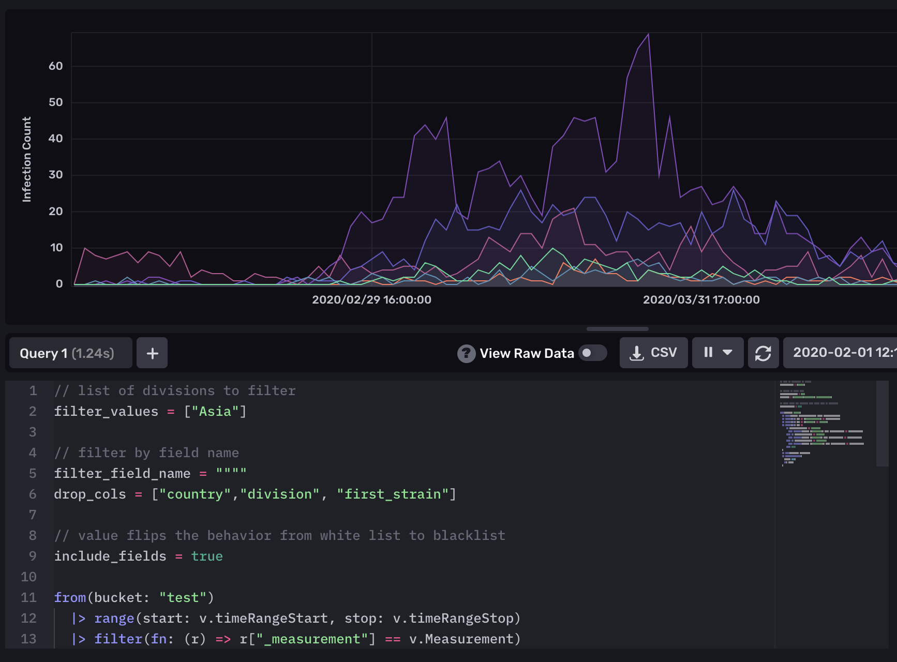

# Time Series analyis of Covid-19 Phylogenetic data generated by NextStrain

This projecct extends the work done by NextStrain to build time series analysis of the phlogenetic data produced by NextStrain. 

## Why was this created
It is intended to be used to do run complex data analysis queries over the large of genome data set. Unlike normal SQL based analysis, this analysis allows researchers to run the queries over specific **periods of times** only.

## How does it work
Using the phlogenetic data produced by NexdStrain's [json](http://data.nextstrain.org/ncov_global.json) output, we build a timeseries stream of events and relation ship between the strains. This data is streamed into a time series database to be used for visualization and analysis.

# Capabilities
Here are the set of capanilities implemented so far. 

### Strains Reported by Region

### Divergence over Region

### Infection by New vs Existing Strains

### Breakdown of New vs Existing Strains by Region

### Mutations and Spread
Track is any of the strain comes from phlogeny with specific mutations. Currently we are looking at D614G but can be extended to look at any other mutations.

### Non-Local Infection
Any strain that is seen in a "division" for the first time. The definition is somewhat arbitrary and was chosen out of common sense and not by biologiy degree. So take it for what its worth and please let me know if there is a better way to define non-local initial infections.

### Time Selector

### Raw Response

### Flexible Query Interface

# Huge Caveats
Currently this is a nights and weekends project so there are lots of ideas in the backlog. I have tried my best to ensure the data and analysis is correct but given the volume of data and my nascent understanding of this field, there will likely be issues with implementation or approach. As with all software, there are likely bugs. Please let me know if you run into issues.
